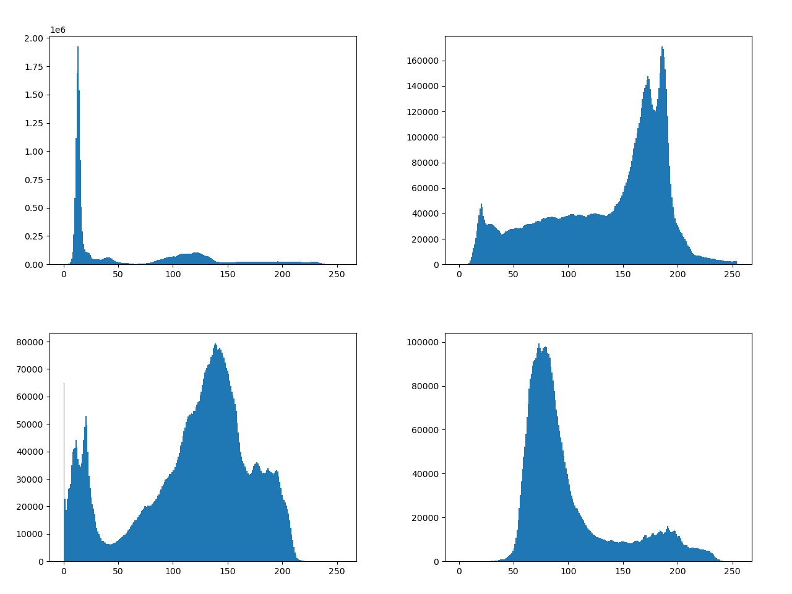

IT Disambiguation
==============================

This model was developed for the **Natural Language Processing** and **Computer Vision** courses,
it is able to understand the correct sense of the target word by using a text disambiguation module based on MPNet and WordNet.
MPNet is used to encode text plus some context and then, after getting from WordNet all the synsets associated to the target word, a score is computed between all the encoded word-synset pairs in order to select the correct synset.
The WordNet synset description is then used to expand the word's context and is given as input to a fine tuned CLIP-based model used to connect text to images.

SemEval-2023
------------

The model was specifically built to address the [SemEval-2023 Visual Word Sense Disambiguation](https://raganato.github.io/vwsd/) challenge.

**Task**: Given a word and some limited textual context, the task is to select among a set of candidate images the one which corresponds to the intended meaning of the target word.
```
@inproceedings{raganato-etal-2023-semeval,
    title = "{S}em{E}val-2023 {T}ask 1: {V}isual {W}ord {S}ense {D}isambiguation",
    author = "Raganato, Alessandro  and
      Calixto, Iacer and
      Ushio, Asahi and
      Camacho-Collados, Jose  and
      Pilehvar, Mohammad Taher",
    booktitle = "Proceedings of the 17th International Workshop on Semantic Evaluation (SemEval-2023)",
    month = jul,
    year = "2023",
    address = "Toronto, Canada",
    publisher = "Association for Computational Linguistics",
}
```

Project Organization
------------

    ├── data                        <- data folder
    │   ├── external
    │   ├── interim
    │   ├── processed
    │   ├── raw
    │   ├── README.md
    │   ├── Test.dvc
    │   └── Train.dvc
    ├── docker-compose.yml
    ├── docs
    ├── dvc.lock
    ├── dvc.yaml                    <- DVC metadata
    ├── frontend			<- frontend application
    │   ├── Dockerfile
    │   ├── index.html
    │   ├── package.json
    │   ├── package-lock.json
    │   ├── public
    │   ├── README.md
    │   ├── src
    │   └── vite.config.js
    ├── LICENSE
    ├── locustfile.py		<- locustfile for application loads testing
    ├── Makefile
    ├── metrics                     <- prediction metrics of the current model
    │   ├── hits1.metric
    │   ├── hits3.metric
    │   └── mrr.metric
    ├── models                      <- trained and serialized models
    ├── notebooks
    ├── prometheus-deploy.yml
    ├── prometheus.yml
    ├── README.md
    ├── references
    ├── reports                     <- pylint reports
    ├── requirements_docker.txt     <- requirements to be used by Docker
    ├── requirements.txt            <- python requirements
    ├── setup.py
    ├── src
    │   ├── api                     <- code for the APIs
    │   ├── conf.py                 <- training configuration file
    │   ├── data                    <- preprocessing code
    │   ├── Dockerfile
    │   ├── __init__.py
    │   ├── models                  <- training and evaluation of the model
    │   └── utils.py
    ├── test_environment.py
    ├── tests                       <- pytest folder
    │   ├── api_testing             <- tests for the APIs
    │   ├── behavioral_testing      <- tests of model's behavior
    │   ├── dataset_testing         <- tests on the dataset
    │   ├── model_testing           <- tests on the model's training
    │   ├── preprocessing_testing   <- tests on the preprocessing code
    │   └── README.md
    └── tox.ini


--------

# How model works
First of all, the sense disambiguator receives context and the target word, producing an output that will be given as input, merged with the target word, to the CLIP text encoder. The text encoder generates embeddings representing the word and its sense based on the provided inputs. 

Simultaneously, the images in the training set are fed into the image encoder. The encoder processes each image, generating the embedding of the image. Simultaneously, the sense disambiguator receives context and the target word, producing an output that will be given as input, merged with the target word, to the CLIP text encoder. 

We end up with N 1024-dimensional vectors for each textual input and 10 · N 1024-dimensional vectors for each image.

We then compute the cosine similarity between the textual embeddings and the image embedding of the ten candidate images, ending up with a similarity matrix of size N × 10. Finally we apply the softmax function on the rows with a temperature parameter τ = 0.01 and take the highest scores as the predictions. As for the metrics used to evaluate the models, we will use Mean Reciprocal Rank, Hits@1 and Hits@3. We obtain the following scores for each metric:
    
| MRR | Hits@1 | Hits@3 |
|-----|--------|--------|
|0.833|0.737   |0.920   |

# Pylint
We utilized the Pylint tool to conduct a comprehensive code cleanup process aimed at achieving a more refined, robust, and readable Python codebase. This effort was directed at minimizing errors and streamlining long-term maintenance.

Through the analyses performed using Pylint, the predominant issues identified were related to indentation errors, extraneous whitespace, lack of module and function-level documentation, overlapping variable names used both locally and globally and instances of excessively long lines. 

Additionally, in order to streamline the analysis process and focus on the most critical aspects, we made a deliberate choice to disable specific pylint error flags. Notably, we disabled 'import-error' flags associated with module imports and errors related to an excessive number of local variables flagged under 'too-many-locals'.

This approach allowed us to concentrate on addressing the most crucial code quality aspects while improving readability, maintainability, and adherence to coding standards within the project.

# Flake8
We also used the Flake8 tool to write cleaner, more readable, and more easily maintainable code, reducing common errors and promoting the adoption of best practices in writing Python code. Even in this case most of the errors were related to indentation errors, extraneous whitespace and instances of excessively long lines. Then, we solve all these errors and we obtain good results from the analyses.


# Grafana
We used the Grafana tool to be able to graphically display some values ​​obtained from Prometheus metrics by performing queries.
The dashboard is divided into four rows, each displaying data related to the past month:

The first row contains four counters:
- The first counter represents the total number of HTTP requests made.
- The second counter displays the number of responses that returned error status codes (in the 400 range) for GET requests.
- The third counter shows the number of responses returning error status codes (in the 500 range) for GET requests.
- The fourth counter indicates the number of responses returning error status codes (in the 400 range) for POST requests.
- The fifth counter represents the number of responses returning error status codes (in the 500 range) for POST requests.


The second row features two time series:
- One related to request sizes measured in bytes.
- The other concerning response sizes, also measured in bytes.


The third row contains two graphs:
- One displaying the average latency in responses.
- The other highlighting the average latency per handler.


In the fourth row, there are two graphs depicting resource usage:
- The first graph illustrates the usage of machine RAM.
- The second graph focuses on the average CPU usage.


# Application Deployment Architecture

This document provides an overview of the deployment architecture for our web application, which consists of monitoring tools, a backend service, and a frontend interface.

## Architecture Diagram


## Azure Deployment

Our web application is hosted on Microsoft Azure, utilizing three separate Azure virtual machines (VMs) to ensure high availability, scalability, and separation of concerns. It was necessary to split the Azure instances because in particular the backend appears to be quite heavy due to the complexity of the taks.

### Virtual Machine Distribution

- **VM1 - Monitoring**: Hosts our monitoring stack which consists of Prometheus and Grafana. This VM is dedicated to collecting and visualizing metrics from our backend service.

- **VM2 - Backend**: Runs our FastAPI backend service. This backend is responsible for handling API requests, processing data, and performing core logic.

- **VM3 - Frontend**: Serves the React frontend application. Designed to deliver a responsive and user-friendly interface, this VM hosts the static files and assets required for the frontend.

### VM1 - Monitoring

  - To configure the virtual machine we used docker compose of the default version of grafana and a customized version of prometheus in which, starting from the original version, we modify the prometheus.yml to allow scraping from the VM2 - Backend.
  Below is the docker-compose code used
  ```
    version: '3.8'

    services:
      grafana:
        image: grafana/grafana
        ports:
          - "3000:3000"

      prometheus:
        image: giovtemp/it-disambiguation-prometheus:1.1
        ports:
          - "9090:9090"

  ```
[Link to VM1](https://it-disambiguation-monitoring.azurewebsites.net/login)


### VM2 - Backend

Our FastAPI backend is encapsulated within a Docker container, originating from a `python:3.8-slim-buster` image to ensure a lean and secure deployment environment. The containerization process leverages Docker to facilitate consistent deployment and operational scalability. Dependencies are meticulously managed through `requirements_docker.txt`, optimizing the build process.

The backend service is hosted on an Azure Basic B3 instance characterized by 4 vCPUs and 7 GB of memory, which is adept for our development and testing workloads. The instance offers an ACU (Azure Compute Unit) of 100, signifying robust computing capabilities to support our application's backend processes. With 10 GB of remote storage and the capacity to scale up to 3 instances, the setup guarantees high availability with an SLA of 99.95%, ensuring the backend's resilience and consistent performance.

Leveraging CI/CD pipelines, the Docker images built during the GitHub Actions workflows are made available at our Docker Hub repository. Each image is tagged with the SHA of the commit that triggered the action, allowing for precise version control and traceability. You can find the Docker images and their respective tags [here](https://hub.docker.com/r/franchinifelice/itdisambiguation/tags).

[Link to VM2 redoc](https://itdisambiguation.azurewebsites.net/redoc)

### VM3 - Frontend

While we have a Dockerfile set up to build a containerized version of our React-based frontend, strategic decisions for hosting on Azure have led us to a different path to optimize for cost and performance. Considering the lightweight nature of our frontend, we opted to deploy it as a Static Web App on Azure, which offers a free hosting plan perfectly suited for applications like ours.

The Azure Static Web App service automates the build and deployment process, enhancing developer productivity and operational efficiency. This service simplifies our deployment workflow and reduces overhead by eliminating the need for container orchestration. Moreover, it aligns with our cost-efficiency goals while still providing the scalability and reliability Azure is known for.

To ensure quality and stability, our CI/CD pipeline is configured to automatically build the frontend and conduct checks before any changes are merged into the `main` branch. This process guarantees that updates are seamlessly and securely deployed to the Azure-hosted application, maintaining a consistent and reliable user experience.

[Link to VM3](https://nice-island-02cd56d03.4.azurestaticapps.net)


Each VM is configured to work in tandem, offering a cohesive and seamless workflow from the user interface down to the data layer.

## Monitoring with Better Uptime

In addition to our internal monitoring with Prometheus and Grafana, we utilize Better Uptime to externally monitor the availability of both the backend and frontend services.
By checking [this page](https://itdisambiguation.betteruptime.com/) it is possible to have an overview of the current status of tha listed websites useful for the system, and any future maintenance and previous incidents if occurred. By joining the application, each member of the team receive an alert whenever an error occurs.

Here's the view to the monitors:


## Load testing using Locust

Lastly we tested the performances of the application using **Locust**, all the possible requests are defined in *locustfile.py*, in particular we test all the four different endpoints of our API:
- Get models list (GET request)
- Get model info (GET request)
- Get image prediction (POST request, **the main task of our project**)
- Get context prediction (POST request)

POST requests are done more frequently as they are the main functionality of our service, in particular the **predict_images** task.

Our service is quite heavy as the model is around 100M parameters and the user has to send to the server one or more images (the predict_image endpoint is the one that has the highest response time), so our server suffers from high response times even with only a few users connected at the time.
This issue could be solved by simply upgrading the hosting service, as the one we are using is a very basic one.

[Here](./reports/locust_report.html) you can find a short report generated by Locust.


# Data drift detection
As explained in the last milestone presentation during lesson, we ultimately decided to not implement any data drift detection mechanism, below are the reasons behind this choice.

**Task definition.** The task that we are trying to solve is a **ranking** problem, given a list of images, one ambiguous target word and one context word, we first disambiguate the target word using the context and then select the correct image among the candidates.

**Problem: data sources.** The first problem we encountered while trying to implement a data drift detector is relative to the sources from where our data is extracted.
Our idea was to extract some features from the input images (like brightness, color histogram, ... ) and then check the drift.
The problem here is that the images in the dataset are scraped from different web sources, this implies that image distribution has a **very high variance**:
Images in the dataset are not "normalized" in any way, have very different subjects, color scales, brightness values and so on, so it is very difficult to detect drifting in this kind of distribution.
In fact, those images do not have any costraint to be used, so the model could technically take an image of any kind as input.


Here we plot the pixel distribution of four random images taken from the dataset, we can see that each of them has a very different pixel distribution (mean and variance).
Despite this, we tried without success to implement a drift detector, so we decided to discard it.

**Drift robustness.** The main benefit of our model is that it is a fine tuned version of **CLIP**, which is very robust to data drifting, as it's pre-trained on a huge amount of data scraped from the web coming from very different data sources (ex. [LAION-2B](https://laion.ai/blog/laion-5b/)).


---


<p><small>Project based on the <a target="_blank" href="https://drivendata.github.io/cookiecutter-data-science/">cookiecutter data science project template</a>. #cookiecutterdatascience</small></p>
