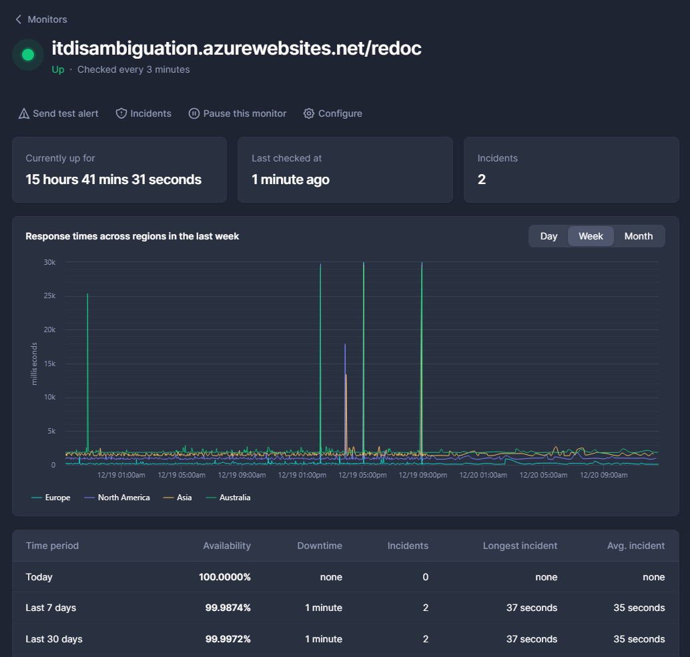

IT Disambiguation
==============================

This model was developed for the **Natural Language Processing** and **Computer Vision** courses,
it is able to understand the correct sense of the target word by using a text disambiguation module based on MPNet and WordNet.
MPNet is used to encode text plus some context and then, after getting from WordNet all the synsets associated to the target word, a score is computed between all the encoded word-synset pairs in order to select the correct synset.
The WordNet synset description is then used to expand the word's context and is given as input to a fine tuned CLIP-based model used to connect text to images.

SemEval-2023
------------

The model was specifically built to address the [SemEval-2023 Visual Word Sense Disambiguation](https://raganato.github.io/vwsd/) challenge.

**Task**: Given a word and some limited textual context, the task is to select among a set of candidate images the one which corresponds to the intended meaning of the target word.
```
@inproceedings{raganato-etal-2023-semeval,
    title = "{S}em{E}val-2023 {T}ask 1: {V}isual {W}ord {S}ense {D}isambiguation",
    author = "Raganato, Alessandro  and
      Calixto, Iacer and
      Ushio, Asahi and
      Camacho-Collados, Jose  and
      Pilehvar, Mohammad Taher",
    booktitle = "Proceedings of the 17th International Workshop on Semantic Evaluation (SemEval-2023)",
    month = jul,
    year = "2023",
    address = "Toronto, Canada",
    publisher = "Association for Computational Linguistics",
}
```

Project Organization
------------

    ├── LICENSE
    ├── Makefile           <- Makefile with commands like `make data` or `make train`
    ├── README.md          <- The top-level README for developers using this project.
    ├── data
    │   ├── external       <- Data from third party sources.
    │   ├── interim        <- Intermediate data that has been transformed.
    │   ├── processed      <- The final, canonical data sets for modeling.
    │   └── raw            <- The original, immutable data dump.
    │
    ├── docs               <- A default Sphinx project; see sphinx-doc.org for details
    │
    ├── models             <- Trained and serialized models, model predictions, or model summaries
    │
    ├── notebooks          <- Jupyter notebooks. Naming convention is a number (for ordering),
    │                         the creator's initials, and a short `-` delimited description, e.g.
    │                         `1.0-jqp-initial-data-exploration`.
    │
    ├── references         <- Data dictionaries, manuals, and all other explanatory materials.
    │
    ├── reports            <- Generated analysis as HTML, PDF, LaTeX, etc.
    │   └── figures        <- Generated graphics and figures to be used in reporting
    │
    ├── requirements.txt   <- The requirements file for reproducing the analysis environment, e.g.
    │                         generated with `pip freeze > requirements.txt`
    │
    ├── setup.py           <- makes project pip installable (pip install -e .) so src can be imported
    ├── src                <- Source code for use in this project.
    │   ├── __init__.py    <- Makes src a Python module
    │   │
    │   ├── data           <- Scripts to download or generate data
    │   │   └── make_dataset.py
    │   │
    │   ├── features       <- Scripts to turn raw data into features for modeling
    │   │   └── build_features.py
    │   │
    │   ├── models         <- Scripts to train models and then use trained models to make
    │   │   │                 predictions
    │   │   ├── predict_model.py
    │   │   └── train_model.py
    │   │
    │   └── visualization  <- Scripts to create exploratory and results oriented visualizations
    │       └── visualize.py
    │
    └── tox.ini            <- tox file with settings for running tox; see tox.readthedocs.io


--------

# Pylint
We utilized the Pylint tool to conduct a comprehensive code cleanup process aimed at achieving a more refined, robust, and readable Python codebase. This effort was directed at minimizing errors and streamlining long-term maintenance.

Through the analyses performed using Pylint, the predominant issues identified were related to indentation errors, extraneous whitespace, lack of module and function-level documentation, overlapping variable names used both locally and globally and instances of excessively long lines. 

Additionally, in order to streamline the analysis process and focus on the most critical aspects, we made a deliberate choice to disable specific pylint error flags. Notably, we disabled 'import-error' flags associated with module imports and errors related to an excessive number of local variables flagged under 'too-many-locals'.

This approach allowed us to concentrate on addressing the most crucial code quality aspects while improving readability, maintainability, and adherence to coding standards within the project.

# Flake8
We also used the Flake8 tool to write cleaner, more readable, and more easily maintainable code, reducing common errors and promoting the adoption of best practices in writing Python code. Even in this case most of the errors were related to indentation errors, extraneous whitespace and instances of excessively long lines. Then, we solve all these errors and we obtain good results from the analyses.


# Grafana
We used the Grafana tool to be able to graphically display some values ​​obtained from Prometheus metrics by performing queries.
The dashboard is divided into four rows, each displaying data related to the past month:

The first row contains four counters:
- The first counter represents the total number of HTTP requests made.
- The second counter displays the number of responses that returned error status codes (in the 400 range) for GET requests.
- The third counter shows the number of responses returning error status codes (in the 500 range) for GET requests.
- The fourth counter indicates the number of responses returning error status codes (in the 400 range) for POST requests.
- The fifth counter represents the number of responses returning error status codes (in the 500 range) for POST requests.


The second row features two time series:
- One related to request sizes measured in bytes.
- The other concerning response sizes, also measured in bytes.


The third row contains two graphs:
- One displaying the average latency in responses.
- The other highlighting the average latency per handler.


In the fourth row, there are two graphs depicting resource usage:
- The first graph illustrates the usage of machine RAM.
- The second graph focuses on the average CPU usage.


# Application Deployment Architecture

This document provides an overview of the deployment architecture for our web application, which consists of monitoring tools, a backend service, and a frontend interface.

## Architecture Diagram


## Azure Deployment

Our web application is hosted on Microsoft Azure, utilizing three separate Azure virtual machines (VMs) to ensure high availability, scalability, and separation of concerns. It was necessary to split the Azure instances because in particular the backend appears to be quite heavy due to the complexity of the taks.

### Virtual Machine Distribution

- **VM1 - Monitoring**: Hosts our monitoring stack which consists of Prometheus and Grafana. This VM is dedicated to collecting and visualizing metrics from our backend service.

- **VM2 - Backend**: Runs our FastAPI backend service. This backend is responsible for handling API requests, processing data, and performing core logic.

- **VM3 - Frontend**: Serves the React frontend application. Designed to deliver a responsive and user-friendly interface, this VM hosts the static files and assets required for the frontend.

### VM1 - Monitoring

  - To configure the virtual machine we used docker compose of the default version of grafana and a customized version of prometheus in which, starting from the original version, we modify the prometheus.yml to allow scraping from the VM2 - Backend.
  Below is the docker-compose code used
  ```
    version: '3.8'

    services:
      grafana:
        image: grafana/grafana
        ports:
          - "3000:3000"

      prometheus:
        image: giovtemp/it-disambiguation-prometheus:1.1
        ports:
          - "9090:9090"

  ```
[Link to VM1](https://it-disambiguation-monitoring.azurewebsites.net/login)


### VM2 - Backend

Our FastAPI backend is encapsulated within a Docker container, originating from a `python:3.8-slim-buster` image to ensure a lean and secure deployment environment. The containerization process leverages Docker to facilitate consistent deployment and operational scalability. Dependencies are meticulously managed through `requirements_docker.txt`, optimizing the build process.

The backend service is hosted on an Azure Basic B3 instance characterized by 4 vCPUs and 7 GB of memory, which is adept for our development and testing workloads. The instance offers an ACU (Azure Compute Unit) of 100, signifying robust computing capabilities to support our application's backend processes. With 10 GB of remote storage and the capacity to scale up to 3 instances, the setup guarantees high availability with an SLA of 99.95%, ensuring the backend's resilience and consistent performance.

Leveraging CI/CD pipelines, the Docker images built during the GitHub Actions workflows are made available at our Docker Hub repository. Each image is tagged with the SHA of the commit that triggered the action, allowing for precise version control and traceability. You can find the Docker images and their respective tags [here](https://hub.docker.com/r/franchinifelice/itdisambiguation/tags).

[Link to VM2 redoc](https://itdisambiguation.azurewebsites.net/redoc)

### VM3 - Frontend

[Link to VM3](https://nice-island-02cd56d03.4.azurestaticapps.net)


Each VM is configured to work in tandem, offering a cohesive and seamless workflow from the user interface down to the data layer.

## Monitoring with Better Uptime

In addition to our internal monitoring with Prometheus and Grafana, we utilize Better Uptime to externally monitor the availability of both the backend and frontend services.
By checking [this page](https://itdisambiguation.betteruptime.com/) it is possible to have an overview of the current status of tha listed websites useful for the system, and any future maintenance and previous incidents if occurred. By joining the application, each member of the team receive an alert whenever an error occurs.

Here's the view to the monitors:




---


<p><small>Project based on the <a target="_blank" href="https://drivendata.github.io/cookiecutter-data-science/">cookiecutter data science project template</a>. #cookiecutterdatascience</small></p>
