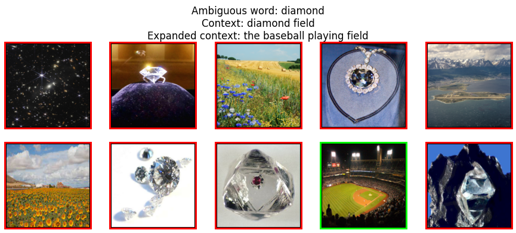

## Dataset Summary

The SemEval-2023 Visual Word Sense Disambiguation dataset includes he training set, validation set, and test set.

**Training Set:**

- **Language**: The training set is available in English, Italian, and Farsi.
- **Size**: The English training set includes more than 12,000 silver training instances.
- **Data Sources**: The data for the training set is primarily obtained from various sources, including Wikidata, OmegaWiki, BabelPic, and BabelNet.
- **Data Construction**: The training set is constructed with the help of semantic networks such as BabelNet and incorporates associated images for ambiguous words. Context words are provided based on each concept's hypernym.
- **Additional Filters**: Human faces are filtered out to avoid them as potential target images.
- **Usage**: The training data serves as the basis for training machine learning models to perform the Visual-WSD task. 

**Validation Set (Trial Data):**

- The trial data is used for early development purposes during the initial phase of the shared task.
- It provides a limited number of gold examples and serves as a preliminary evaluation dataset for system development.

**Test Set:**

- **Language**: The test set is also available in English, Italian, and Farsi.
- **Data Sources**: The gold testing data is collected from sources like BabelNet and involves ambiguous word senses, images, and definitions.
- **Annotation Process**: For each word sense in the test set, human annotators provide one or two trigger words that can be used to identify the intended meaning of the word sense when considering the association between definition and image.
- **Negative Samples**: The test set includes negative sample images to ensure that models can distinguish the correct sense from incorrect senses.
- **Size**: The English test set contains 463 gold test annotations, while the Farsi and Italian test sets contain 200 and 305 annotations, respectively.
- **Usage**: The test set is used to evaluate the performance of the systems developed for the Visual-WSD task and is the main dataset for assessing the accuracy of models in selecting the correct image for an ambiguous word.
                                       

Every sample has the following features:
- **Target word:** an ambiguous word associated to the target image
- **Context:** another word giving the context of the target word
- **Images:** a list of ten ambiguous images that could be associated to the target word
- **Target image:** the correct image among the ten

  

## Using the Dataset
This dataset can be used to train a model to associate an image to a word that has more than one intended meaning when we have only a limited context.

## More informations
More informations about the dataset can be found on the [official SemEval-2023 website](https://raganato.github.io/vwsd/).
