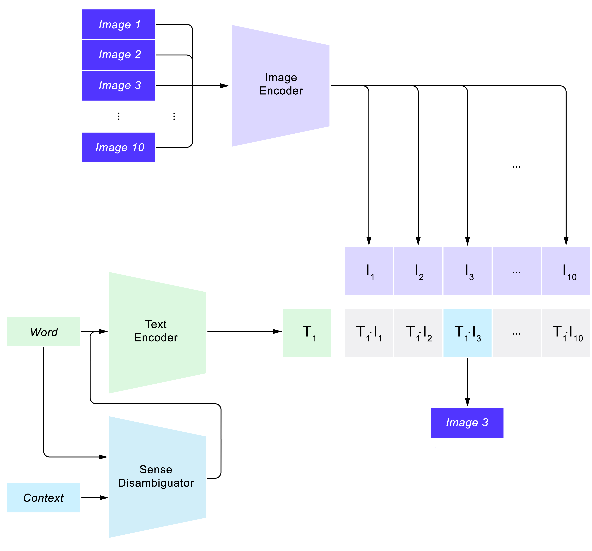

---
language:
- en
license: MIT
tags:
- Computer Vision
- Natural Language Processing
- CLIP
- Deep Learning
- Disambiguation
- SemEval-2023
datasets:
- LAION-2B
- SemEval-2023 Visual Word Sense Disambiguation
metrics:
- mrr
- hits@1
- hits@3

model-index:
- name: IT-Disambiguation
  results:
  - task:
      type: text-to-image
      name: Text to Image
    dataset:
      type: SemEval-2023_VWSD
      name: SemEval-2023 Visual Word Sense Disambiguation
    metrics:
      - type: mrr
        value: 0.833
        name: Mean Reciprocal Rank
      - type: hits@1
        value: 0.737
        name: Hits@1
      - type: hits@3
        value: 0.920
        name: Hits@3
---

# Model Card for Image/Text disambiguation model

  

This model is able to choose the correct image among a list of candidate images given an ambiguous target word and a limited context.

## Model Details

### Model Description

The model is able to understand the correct sense of the target word by using a text disambiguation model based on MPNet and WordNet.
MPNet is used to encode text plus some context and then, after getting from WordNet all the synsets associated to the target word, a score is computed between all the encoded word-synset pairs in order to select the correct synset.
The WordNet synset description is then used to expand the word's context and is given as input to a fine tuned CLIP-based model used to connect text to images.

- **Authors:** Francesco Bottalico, Felice Franchini, Giovanni Tempesta, Michele Di Carlo, Federico Chiaradia
- **Model date:** 18/06/2023
- **Model version:** v1.0
- **Model type:** Disambiguation model based on Vision Transformer combined with Text Transformer
- **Training algorithm:** The CLIP model used as backbone is already trained on LAION-2B, the entire model is then fine tuned for two epochs on SemEval-2023 Visual Word Sense Disambiguation dataset using AdamW as the optimization algorithm with $\gamma = 2 \times 10^{-5}$ and a weight decay $\lambda = 0.01$
- **Useful papers:** [Learning Transferable Visual Models From Natural Language Supervision](https://arxiv.org/pdf/2103.00020.pdf)
- **License:** MIT License

## Intended Use

The model is highly versatile and can be used in many ways according to the use case:
- Select the correct image given a word and some context (primary use case)
- Use the model as a zero-shot classificator, selecting the correct label given an image

### Primary Intended Use

The primary use case on which the model is trained on is to select the correct image among a list of candidates, given an ambiguous word and some context.
Images can represent the different meanings of the word and the model should be able to use the given context to select the intended one.

### Primary Intended Users

The model can be used for various purposes. Among the primary intended users are certainly 
content creators and writers who want to enhance the quality and context of their written content,
ensuring that the intended meaning of words is accurately conveyed. It is also relevant for developers 
of text-to-image applications, where textual descriptions are transformed into visual representations, 
and they can use this model to ensure that the generated images align with the intended textual descriptions.

### Out-of-Scope Use

The model is limited to english only, it may work on other languages but its usage has not been tested.

## Factors

Since the dataset used during the pre-training phase (LAION-2B) is a huge collection of images-text pairs scraped from the web, data has an high variance on instrumentational and enviromental factors.
For more information about the data check [LAION-2B website](https://laion.ai/blog/laion-5b/).

## Metrics

We evaluated the model using metrics suggested by the SemEval-2023 challenge.
It makes sense to use ranking metrics to evaluate the model since our task is to select one among many images.

- **Model performance measures:** Mean Reciprocal Rank, Hits@1 and Hits@3.
- **Decision thresholds:** A probability distribution is obtained as output of the model, so we choose the image associated with the highest score.

## Evaluation Data

- **Dataset:** The evaluation dataset is given by the SemEval-2023 challenge and has a total of 463 samples with 259 unique target words and 8100 total images.
- **Motivation:** This model was developed to target this specific challenge so we evaluated it on the relative dataset.
- **Preprocessing:** Text was tokenized and made compatible with text encoder input, images were resized to a compatible size (224x244) and cropped if necessary.

## Training Data

The pre-training data (LAION-2B) is composed of image-text pairs, more information on their [website](https://laion.ai/blog/laion-5b/).
SemEval-2023 VWSD data is composed of 12896 samples, each entry has a target word, a short context (usually one word) and ten candidate images of which one is the correct one.

[Here](../data/README.md) you can find the dataset card for more information about the data.

## Quantitative Analyses

The model got the following results on the SemEval-2023 VWSD evaluation dataset:

| MRR | Hits@1 | Hits@3 |
|-----|--------|--------|
|0.833|0.737   |0.920   |

## Caveats and Recommendations

The model was tested on an highly ambiguous dataset, so we can see that it addresses the ambiguity problem very well, even if the context is very limited (only one word).
Keep in mind that the model works only on limited context, so it **must** contain only a single word or a single contextual word plus some stop words.
Another limitation is that we use WordNet as the ontology, that's not the most complete language ontology out there as it may lack some words.

## Energy consumption
In the training phase of the model, it has been tracked the enviromental impact, using Code Carbon, a Python package that enables to track emissions in order to estimate the carbon footprint of an experiment.

The result of the training phase are reported into the [emissions.csv](../reports/emissions.csv) file, including metrics like: 
- Duration of the compute (in seconds) 
- Emissions as CO2-equivalents(in kg) 
- Energy consumed (in kWh)

The model was trained using a shortened dataset and training duration.
In order to provide a scaled version of the carbon emissions and energy consumption metrics, related to the training of the model with the full size dataset,
the values obtained have been multiplied by the scaling factor of the original dataset.

- **co2_eq_emissions**: 
	- **emissions**: 0.001477 ([CO₂eq], in kg)
	- **source**: "Code carbon" 
	- **training_type**: "pre-training" 
	- **geographical_location**: "Quebec, Canada" 
	- **hardware_used**: 
		- **cpu_model**: "Intel(R) Xeon(R) CPU @ 2.20GHz"
		- **cpu_count**: 2
		- **gpu_model**: "Tesla T4"
		- **gpu_count**: 1
